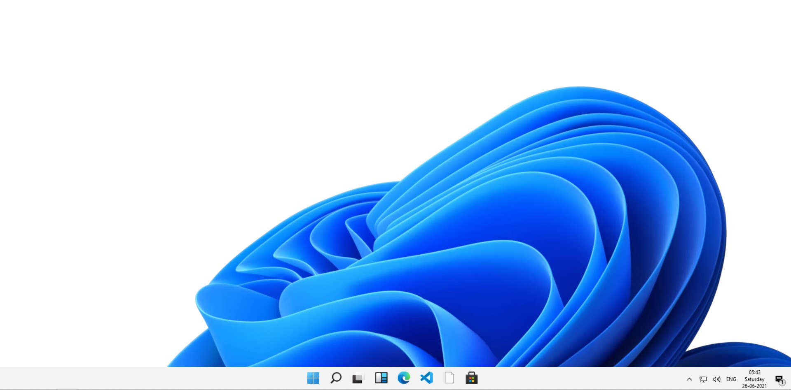
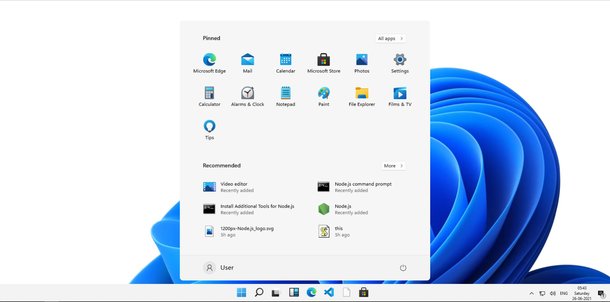

# Windows-11 - using HTML

This is just a fun project developed using HTML, CSS and JavaScript.

<!--
Disclaimer and Fair Use Statement: This project may contain copyrighted material, the use of which may not have been specifically authorized by the copyright owner. This material is available in an effort to explain issues relevant to the Digital Humanities and foreign language education ( eg. historical, environmental, political, scientific, etc. or) or to illustrate the use and benefit of an educational tool.. The material contained in this website is distributed without profit for research and educational purposes. Only small portions of the original work are being used and those could not be used easily to duplicate the original work.
This should constitute a "fair use" of any such copyrighted material (referenced and provided for in section 107 of the US Copyright Law).

If you wish to use any copyrighted material from tis site for purposes of yout own that go beyond "fair use", use must obtain expressed permission from the copyright owner. -->

# Project Screenshots

# Home Screen

 

# Task Bar - Menu

# Note For Developers

### Technologies Used:

1. HTML5
2. CSS3
3. JavaScript

You can run the below commands to see the project on your local system.

# Steps to run this project on your local machine:

### Step - 1

Download the zip file from the above "Code" option, \
 or, \
Clone this repository by running the command "git clone https://github.com/shivendradb/Windows-11---using-HTML.git" on the command prompt on your machine. \
Now, open the project directory using "cd Windows-11---using-HTML" command.

### Step - 2

In the project directory, Copy the path of the "index.html" file by right clicking and chossing the "copy the path" option.

Paste this path address on your browser.

Great!! 😃 You are done here. 🚀

The page will reload if you make edits.\
You will also see any lint errors in the console.
